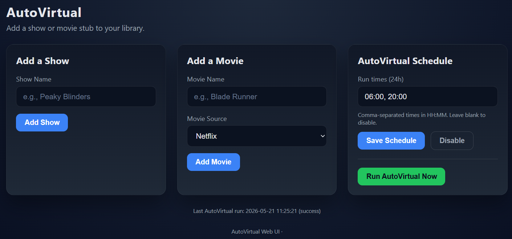

# script.virtualepisodes

Set of utilities to provide dummy episodes for streaming provider content.

Problem:

Want to be able to track streaming provider TV episodes within Kodi, but just watch them in the native app rather than constantly chasing Kodi Netflix/Prime .strm compatibility.

Solution:

- A Flask web interface acts as the front door for adding Sonarr tracked shows and movie stubs
- Emby/Jellyfin indexes the dummy files like normal media
- Kodi service.py detects the streaming provider in the stub filename on playback and launches the native app
- Runs on a lightweight WebUI configurable schedule (or on demand) to create placeholder episodes from the Sonarr calendar
- Supports on-demand backfills for already aired episodes with streamed output log
- Lets you map networks and show-name keywords in Web UI or [config.yaml](config.yaml)
- Shows Sonarr suggestions when a series name is not found, with sorting options

Limitations:

- Kodi service only set up to work with Android right now (test on Firecube3, Homatics BoxR 4K+ and NVidia Shield)
- Must use direct paths in Kodi so that the service can see the filename
- Does not launch episode directly, still have to navigate in native app again

Usage:
- Copy the config.yaml_EXAMPLE file to config.yaml edit as needed
- Add Netflix/Amazon shows to Sonarr as normal, but set to 'unmonitored'
- Install dependencies: Flask and PyYAML
- Start the server with python flask_app.py (or run [flask_app.py](flask_app.py) in your environment)
- Open http://localhost:8086 in a browser (or http://<host>:8086 if hosting on another machine)
- Set up service.py which launching the streaming apps as Kodi addon - may need to modify app names for your box

Version history:
- 2026-05-21: Added web scheduling for AutoVirtual with a Run Now option, plus show-map and network-map tools in the UI.
- 2026-05-21: Added Sonarr not-found suggestions with sorting options in the web UI.
